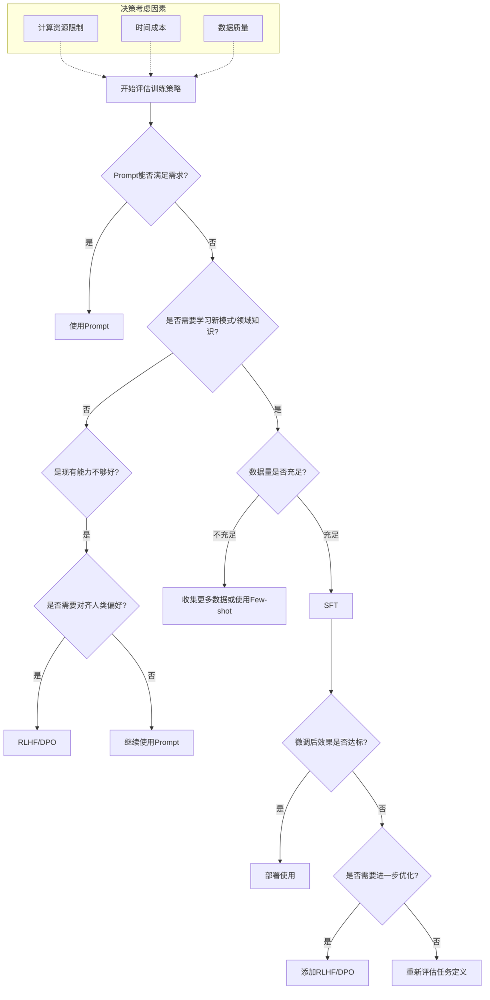

# 引言

通常的全参数的llm训练流程是：

```
base模型 -> SFT --> RM --> PPO


base模型 --> SFT --> DPO
```

但作为消费级用户，我们大部分情况下不会使用全参数微调。一方面是没那个设备和金钱，另一方面就是要构造的数据太多太大。因为现有llm本身已经非常优秀了，我们在一些工程落地方面，甚至只需要构建好的`prompt`就足够了。

但是凡事总有例外，`prompt`总有hold不住的时候，总结下来可以是：

- 1. 缺乏特定领域数据
- 2. 任务过于复杂，prompt写的太多太长，效果也不好
- 3. 模型要学习一种新的固定模式
- 4. 其他.....

所以我们就需要基于LoRA的SFT、RLHF以及DPO等微调。

在实际落地任务的时候，还是很容易迷惑的到底选择什么训练策略。
1. model+prompt
2. model+sft
3. model+rlhf/dpo
4. model+sft+rlhf/dpo

```ad-hint
后续所有的训练都是基于LoRA的，就不在重复
```
# 定义

让我们回顾一下SFT的概念：

> 监督微调（Supervised Fine-Tuning，SFT）是一种机器学习技术，用于调整已经过预训练的大型模型，使其更好地适应特定任务或领域。SFT是在模型预训练的基础上，利用特定任务的标注数据进行进一步训练，以提升模型在该任务上的性能。

SFT的本质是教会模型“如何做”，也就是说，如果模型已经知道这类任务怎么做的话，我们可以提供更为符合任务场景的数据来提高该任务的表现结果，也可以通过RLHF来对齐模型的输出和人类意图。举例来说，比如对文本进行“总结”，其实llm已经知道了怎么总结了，那我们就不需要SFT了。

对于“总结”或者“摘要生成”的任务，我们需要它**做的更好**，那么我们其实需要对齐进行的`RLHF`或者`DPO`。所以当任务需要的核心能力(capability)已经内嵌在预训练阶段获得的general capability中时,我们就可以跳过SFT。

那么思路就变得清晰起来了，简单粗暴归纳：
- 如果我们要学习一种**新的模式**，我们就需要SFT。
- 如果prompt的指导无法满足工程上需求，我们就需要SFT。
	- 随对话边长而忘记prompt的要求
	- prompt的输出格式不固定
	- 等等...

```ad-question
那我还是不太明白训练策略到底怎么选择，怎么办
```

# 一个例子

在工作中，经常会遇到一知半解的老板对你刚刚做的事来一句

```
你这个事，llm能不能做？
```

这在传统的nlp领域尤为常见，虽然很不爽，但是也不怪的老板们这么想。在商业化的nlp领域，其实对语义理解的精度要求没有那么高，或者说识别出关键要素即可。**如果能通过llm来解决，岂不是又能剩下一笔牛马费？**

幸运的是，一般的llm都是系统用任务，尽管有些人通过prompt，让llm在示例上展现出了比较好的效果。尤其NLP任务可能还是复和的，比如既要IE（信息抽取）又要RE（关系抽取）还要做生成式/抽取式摘要。或许你会说，我可以通过并行的workflow来实现啊，但是工程上，prompt还真不能保证输出格式的统一。

不幸的是，我们可以微调啊！对于数据精度要求没么高的一些任务，llm确实可以通过简单的微调和prompt构建来实现NLP的一些任务。

## 单纯的prompt指导信息抽取

假设我有两段文本：

```
张伟是一名35岁的软件工程师，目前在北京字节跳动工作。他于2010年毕业于清华大学计算机系，有12年工作经验。他擅长Python和Java开发，目前月薪45000元。他的联系方式是：电话13812345678，邮箱zhangwei@example.com。
```

```
李红，女，28岁，现任阿里巴巴产品经理。本科毕业于北京大学工商管理专业，研究生毕业于复旦大学。熟悉用户研究和数据分析，负责过多个重要项目。联系电话15987654321，电子邮箱lihong@example.com，目前年薪40万。
```

未经训练，仅使用prompt的情况下，可能出现的不一致输出，以`kimi`（2025-1-19）为例：


这里我们用了同样的`prompt`，不同的是给定的抽取文本。但是`kimi`给出的回答存在两个问题。
### 问题

**输出内容格式不同**

在第一个回答，使用markdown语法，也就是包含了\`\`\`开头，这样在输出显示的的时候会自然而然的被渲染。
```
```json
json内容
```

而第二个回答，则是直接以text输出了json。

表面上，他已经非常接近我们想要的结果了。但是这种不可控的细小差别带来的是提取结果的代码需要不断配合llm。

**抽取风格无法统一**

在第一个例子中的技能，模型给出的是`擅长Python和Java开发`，但如果我要的是`['Python', 'Java']`怎么办？

在第一个例子里的学历的结果是
```
学历：2021年毕业于清华计算机系
```

而第二个例子是
```
学历：{
"本科":"北京大学工商管理专业",
"研究生":"复旦大学"
}
```

两个回答在学历部分的抽取风格不同，导致了实际结果还是需要二次处理。当然我们可以通过丰富`prompt`的方式，比如`one-shot`在这个任务上就能取得很好的效果。不过我们还是回到训练策略上。

先前说过`sft`是对**特定任务**进行训练，因为llm先前可能对这类任务没有足够的学习。但是我们的通用信息抽取，其实llm**已经会了**，只是做的**还不够好，还不够满足我的需求**。

```ad-summary
当llm**已经学会某些任务**，但仍然**不够好**，我想通过训练策略来提升模型输出质量，来更**符合我的偏好**，我就可以选择`RLHF`或者`DPO`。

注意:我们仍然可以使用SFT来帮助llm提高其在此类任务上的效果。实际的时间成本和数据治理的成本考虑在内的话，就需要斟酌。
```

# 更为复杂的例子

## 包含医学知识的特定任务

好，现在上点难度，刚才说**通用的信息抽取**，llm已经会了。但是如果我给出了**专业信息**，他依然能抽取么？

```
患者王某，女，45岁，因"反复头痛3月，加重1周"来我院就诊。患者3个月前无明显诱因出现头痛，以双侧额部胀痛为主，疼痛程度为4-5分（疼痛评分0-10分），每次持续2-3小时，休息后可缓解。1周前头痛加重，频率增加，伴有恶心、畏光。既往有高血压病史2年，目前服用缬沙坦片控制。否认糖尿病、冠心病等其他疾病。体格检查：BP 135/85mmHg，神志清楚，双瞳对光反射灵敏。
```

现在的情况是llm可能学过医疗数据，它也知道通用的信息抽取，但是这两者结合起来的情况，它多半没有碰过，尽管的他也能做到一定程度的抽取，而我想要的结果可能是非常复杂的，比如：

```
{
  "medical_record": {
    "basic_info": {
      "gender": "女",
      "age": 45
    },
    "chief_complaint": {
      "symptom": "头痛",
      "course": {
        "total_duration": "3月",
        "aggravation_duration": "1周"
      }
    },
    "present_illness": {
      "onset": {
        "time": "3月前",
        "trigger": "无明显诱因"
      },
      "pain_characteristics": {
        "location": "双侧额部",
        "nature": "胀痛",
        "severity": {
          "scale": "4-5",
          "reference": "0-10分"
        },
        "duration": {
          "value": "2-3",
          "unit": "小时",
          "frequency": "每次"
        },
        "relieving_factors": ["休息"]
      },
      "recent_changes": {
        "time": "1周前",
        "manifestations": [
          {
            "symptom": "头痛",
            "change": "加重"
          },
          {
            "symptom": "发作频率",
            "change": "增加"
          }
        ],
        "associated_symptoms": [
          "恶心",
          "畏光"
        ]
      }
    },
    "past_medical_history": {
      "hypertension": {
        "status": "确诊",
        "duration": {
          "value": 2,
          "unit": "年"
        },
        "treatment": {
          "medication": "缬沙坦片",
          "status": "在用"
        }
      },
      "negative_history": [
        "糖尿病",
        "冠心病"
      ]
    },
    "physical_examination": {
      "vital_signs": {
        "blood_pressure": {
          "systolic": 135,
          "diastolic": 85,
          "unit": "mmHg"
        }
      },
      "neurological": {
        "consciousness": "清楚",
        "pupillary_light_reflex": "灵敏",
        "pupils": "双侧"
      }
    }
  }
}
```

很明显，在这个例子里，如果我们在用`one-shot`或者`few-shot`已经不合理了。

直接进行`RLHF`或者`DPO`似乎也不是很好，因为这里包含了挺多的专业知识，所以这似乎就是我们说的一种`特定任务`，这个特定任务可以描述为：

```
从患者的诊断描述中提取出json数据
```

我们从策略的选择上，至少要包含了`SFT`，所以我们现在的模式就是

```
model + sft
```

```ad-question
那是不是sft以后就足够了？
```

**还真不是**

## 各种各样的包含专业知识的文本

我们想象中的文本，的理想输入是：
```
患者王某，女，45岁，因'反复头痛3月，加重1周'来我院就诊...
```

但是实际的接触到的文本可能是：
```
老王头疼了好几个月了，这段时间更严重了，血压还挺高，天天吃降压药...
```

```
患者每周都要去医院做透析，一直服用安络血，偶尔头晕...
```

当遇到这种**口语化**、**碎片化**的信息，但是又包含了比较种重要的医疗信息的时候，我们怎么办？这又变成了llm已经学习过这个任务，但是面对低质量的数据的时候，它**做不好**

于是我们又在原来的训练基础上加入了`RLHF/DPO`，现在的训练策略就变成了

```
model + SFT + RLHF/DPO
```


# 总结

```ad-summary
需要SFT的**特定任务**可以被视为那些涉及模型在预训练中**未遇到的模式或数据分布**，或者需要将模型**输出与特定指令或期望结果对齐的任务**。SFT有效地**结合了领域特定知识与模型的通用能力**。在实现高质量SFT之后，如果需要进一步提高性能或与人类偏好对齐，技术如RLHF和DPO。在实际应用中，评估应根据任务的具体要求和目标进行定制。
```




# 其他场景

扩展开来想想，面对非结构化数据，我想要直接从HTML中提取要怎么办呢？


